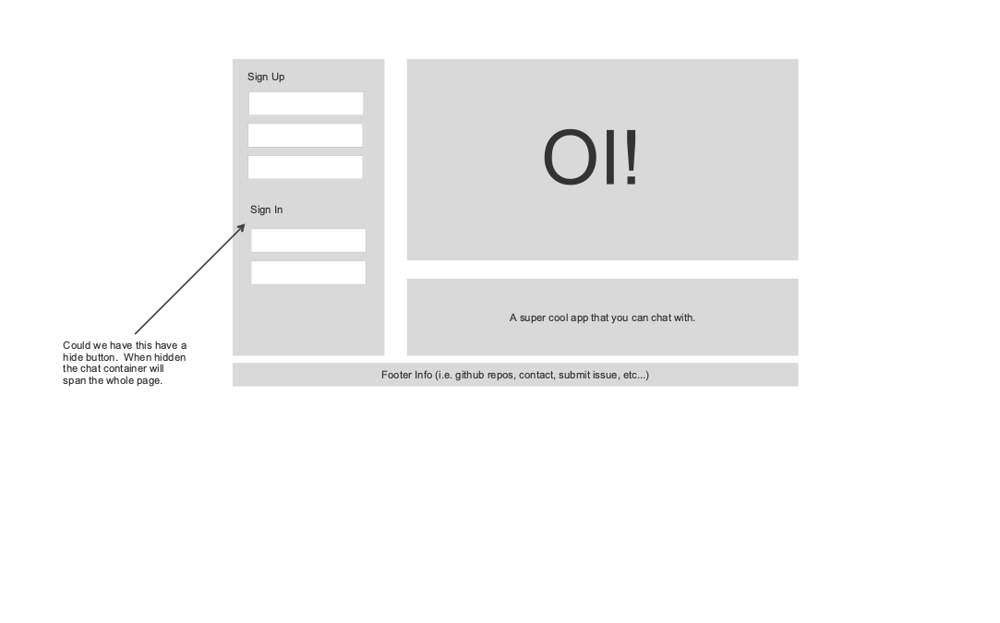
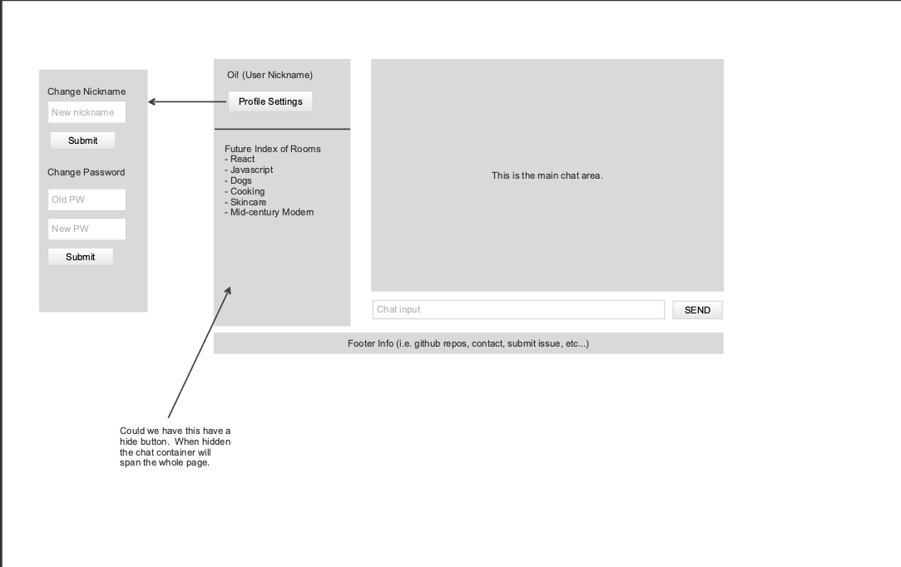
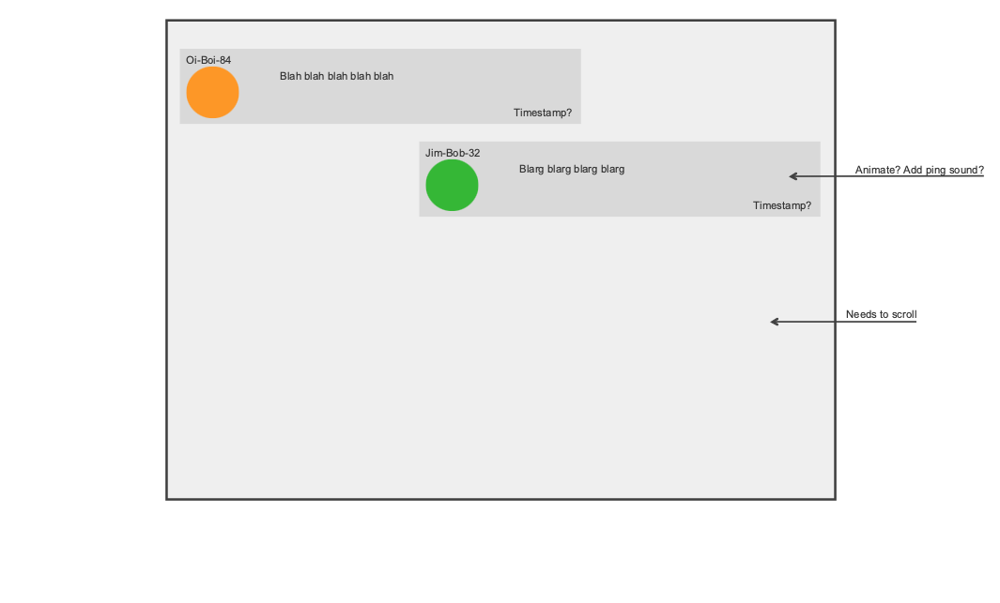

Oi App - A Chat Application

## Description:
The Oi Chat Application is a web application that allows user to chat with one another in real time. Users are able to create accounts and sign in and customize their own profiles (nickname, avatar). Users will be able to see other messages from other users inside the chatroom. Our application was created using react and socket.io technologies. This group project was made possible by implementing agile and scrum methods to create a cohesive workflow between developers. This client contains our first version (MVP) of our application.

## Planning Story
Working in a group setting and learning new concepts such as socket.io and react pushed each individual as a developer and showed each persons strengths. The group developed strategies to be meet the project deadline by using scrum and agile concepts to plan and discuss the moving parts of the project.

## User Stories
- As a user I want to: Sign Up
- As a user I want to: Sign In
- As a user I want to: Change my password
- As a user I want to: Sign Out
- As a user I want to: Send a chat message
- As a user I want to: Recieve a chat message
- As a user I want to: See who is in the chatroom
- As a user I want to: See all the profiles
- As a user I want to: Veiw a specific profile
- As a user I want to: Set my profile nickname
- As a user I want to: Set my profile avatar
- As a user I want to: Update my profile nickname
- As a user I want to: Update my profile avatar
- As a user I want to: Delete my profile

## Technologies Used
- React
- NodeJS
- Socket.io (client)
- Axios
- HTML
- SCSS
- React-Bootstrap
- Bootstrap
- NPM
- JSX
- Javascript

## WireFrames

